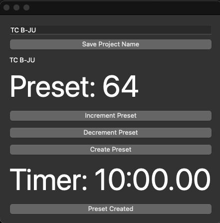

I Make presets for [presetfood.com](presetfood.com) most days and I need to keep track of the current project. 
Productivity timer for the creation of presets for software synths. 

Productivity Timer: 
By TC 

This is a very personal productivity timer: but might be some use to someone doing the same kind of stuff as me. 

I give myself 10 minutes per preset. 
The preset name is the text in between the number and the name of the preset I am working on. 

It saves the current state of the project in a file named state.json so when you reload the program it remembers 
state. 
track.json is a log of how long it has taken between the pushing of the create preset button and preset created button.

